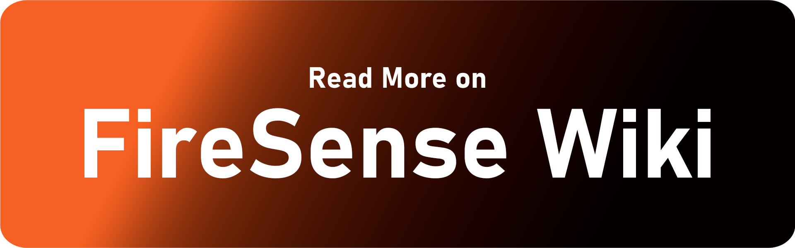
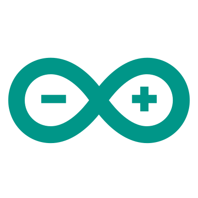

    <picture>
      <source 
        srcset="./Readme-Assets/light-text.png"
        media="(prefers-color-scheme: dark)"
      />
      
    </picture>
  

<h4 align="center">🔥The Wildfire Detection Node Network 🔥</h4>
<h6>
This project focuses on creating a wireless mesh network for early wildfire detection using LoRa. Wildfires pose significant threats to ecosystems, property, and human life, especially in remote areas where detection and response times are often delayed. The system leverages multiple nodes equipped with smoke sensors spread across a forest, forming a mesh network to relay fire alerts to a gateway, which then sends the alerts to a remote monitoring system.
</h6>

### Key Features:
- **Early Detection**: Detect wildfires at an early stage to enable a faster response.
- **Local Mesh Communication**: Nodes communicate wirelessly and locally, relaying data to the hub, ensuring reliable communication even in rugged environments.
- **Low Power Consumption**: Designed for long-term deployment in remote areas with limited access to power.
- **Scalability**: Easily expandable by adding more nodes to the network.
- **Reliability**: Ensures the network can function even if some nodes are temporarily out of communication range.

 

	<code></code>
	<code></code>
	<code></code>
	<code></code>
	<code></code>

## License

This project is licensed under the MIT License. See the [LICENSE](./LICENSE.txt) file for details.
